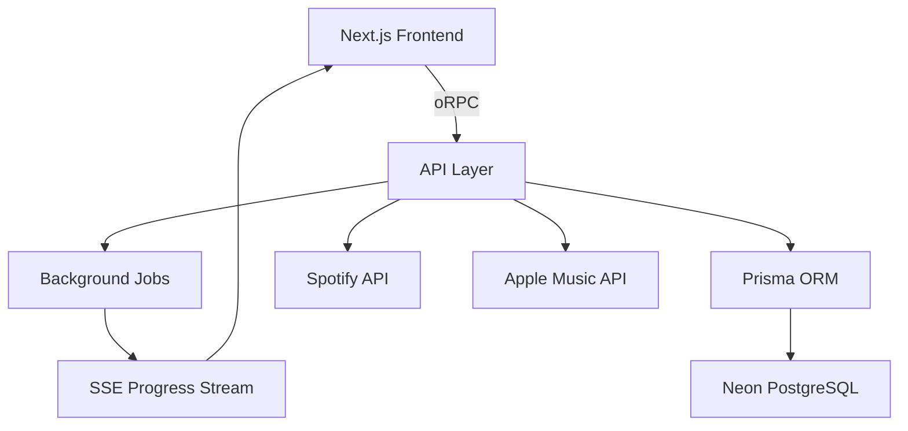

# 📋 Product Requirements Document: Spotify → Apple Music Full Library Transfer

## 🎯 Product Overview

**Goal**: Enable users to transfer their entire Spotify library to Apple Music with full transparency, selective transfer options, and background processing.

**Key Features**:
1. Single playlist transfer (existing)
2. Full library transfer with playlist selection
3. Background processing with real-time progress
4. Detailed failure explanations
5. Quick ISRC mode vs Deep matching

## 🏗️ Technical Architecture



## 📊 Database Schema (Prisma)

```prisma
// schema.prisma
model User {
  id            String    @id @default(cuid())
  email         String    @unique
  spotifyId     String    @unique
  createdAt     DateTime  @default(now())
  transfers     Transfer[]
  transferJobs  TransferJob[]
}

model Transfer {
  id                String    @id @default(cuid())
  userId            String
  user              User      @relation(fields: [userId], references: [id])
  status            TransferStatus
  mode              TransferMode
  startedAt         DateTime  @default(now())
  completedAt       DateTime?
  spotifyData       Json      // Full library snapshot
  totalPlaylists    Int
  totalTracks       Int
  successfulTracks  Int       @default(0)
  failedTracks      Int       @default(0)
  jobs              TransferJob[]
  createdAt         DateTime  @default(now())
}

model TransferJob {
  id            String    @id @default(cuid())
  transferId    String
  transfer      Transfer  @relation(fields: [transferId], references: [id])
  userId        String
  user          User      @relation(fields: [userId], references: [id])
  chunkIndex    Int
  totalChunks   Int
  playlists     Json      // Array of playlist IDs
  status        JobStatus
  progress      Float     @default(0)
  tracks        TransferTrack[]
  startedAt     DateTime?
  completedAt   DateTime?
  error         String?
  createdAt     DateTime  @default(now())
}

model TransferTrack {
  id              String    @id @default(cuid())
  jobId           String
  job             TransferJob @relation(fields: [jobId], references: [id])
  spotifyTrackId  String
  spotifyData     Json
  appleTrackId    String?
  appleData       Json?
  status          TrackStatus
  failureReason   FailureReason?
  confidence      Float?
  processingTime  Int?      // milliseconds
  createdAt       DateTime  @default(now())
  
  @@index([spotifyTrackId])
  @@index([status])
}

enum TransferStatus {
  ANALYZING
  QUEUED
  PROCESSING
  COMPLETED
  FAILED
  CANCELLED
}

enum TransferMode {
  QUICK     // ISRC only
  STANDARD  // Current algorithm
  DEEP      // Future: with manual review
}

enum JobStatus {
  PENDING
  PROCESSING
  COMPLETED
  FAILED
}

enum TrackStatus {
  PENDING
  MATCHED
  FAILED
  SKIPPED
}

enum FailureReason {
  REGION_LOCKED
  NOT_ON_APPLE_MUSIC
  ALBUM_MISSING
  METADATA_MISMATCH
  ISRC_INVALID
  API_ERROR
}
```

## 🚀 Detailed PR Roadmap

### Phase 1: Foundation

#### PR 1.1: Database Setup & Prisma Configuration
**Files**: 
- `prisma/schema.prisma`
- `lib/prisma.ts`
- `.env.local` (Neon connection)
- `package.json` (add Prisma deps)

**Tasks**:
- Install Prisma and setup Neon DB connection
- Create schema with User, Transfer, TransferJob, TransferTrack models
- Add Prisma client singleton
- Create migration scripts
- Add seed data for testing

**Acceptance Criteria**:
- [ ] Database connects successfully
- [ ] Migrations run without errors
- [ ] Basic CRUD operations work

---

#### PR 1.2: oRPC Setup & Basic Routes
**Files**:
- `lib/orpc/client.ts`
- `lib/orpc/server.ts`
- `app/api/orpc/[...]/route.ts`
- `lib/orpc/routers/auth.ts`

**Tasks**:
- Install oRPC dependencies
- Setup oRPC client/server configuration
- Create auth middleware
- Implement basic auth routes
- Add type exports

**Acceptance Criteria**:
- [ ] oRPC endpoints accessible
- [ ] Type safety working end-to-end
- [ ] Auth middleware protects routes

---

### Phase 2: Spotify Library Discovery

#### PR 2.1: Expanded Spotify Auth & Permissions
**Files**:
- `app/api/auth/[...nextauth]/route.ts`
- `components/PermissionRequest.tsx`
- `lib/spotify-scopes.ts`

**Tasks**:
- Add `user-library-read` scope
- Create permission upgrade flow for existing users
- Add scope validation
- Update session types

**Acceptance Criteria**:
- [ ] New users get all scopes
- [ ] Existing users can upgrade permissions
- [ ] Scope validation works

---

#### PR 2.2: Library Discovery API
**Files**:
- `lib/orpc/routers/spotify.ts`
- `lib/spotify/library-fetcher.ts`
- `types/spotify-library.ts`

**oRPC Routes**:
```typescript
spotify: {
  getLibraryOverview: pub
    .use(auth)
    .query(() => SpotifyLibraryOverview),
    
  getUserPlaylists: pub
    .use(auth)
    .input(z.object({ 
      limit: z.number().default(50),
      offset: z.number().default(0) 
    }))
    .query(() => PlaylistPage),
    
  getSavedTracks: pub
    .use(auth)
    .input(z.object({ 
      limit: z.number().default(50),
      offset: z.number().default(0) 
    }))
    .query(() => SavedTracksPage),
}
```

**Acceptance Criteria**:
- [ ] Can fetch all user playlists
- [ ] Can fetch saved tracks with pagination
- [ ] Library overview shows correct counts

---

### Phase 3: Transfer UI - Playlist Selection

#### PR 3.1: Library Overview Dashboard
**Files**:
- `app/library/page.tsx`
- `components/LibraryOverview.tsx`
- `components/LibraryStats.tsx`

**Features**:
- Show total playlists, tracks, estimated transfer time
- Quick actions: "Transfer All", "Select Playlists"
- Transfer mode selector (Quick/Standard)

**Acceptance Criteria**:
- [ ] Dashboard loads library stats
- [ ] Transfer time estimation accurate
- [ ] Mode selection persists

---

#### PR 3.2: Playlist Selection Interface
**Files**:
- `components/PlaylistSelector.tsx`
- `components/PlaylistCard.tsx`
- `hooks/usePlaylistSelection.ts`

**Features**:
- Checkbox list of all playlists
- Select all/none/invert
- Search/filter playlists
- Show track count per playlist
- "Liked Songs" as special playlist

**Acceptance Criteria**:
- [ ] Can select individual playlists
- [ ] Select all works correctly
- [ ] Search filters in real-time
- [ ] Selection state persists

---

### Phase 4: Background Transfer System

#### PR 4.1: Transfer Job Creation
**Files**:
- `lib/orpc/routers/transfer.ts`
- `lib/transfer/job-creator.ts`
- `lib/transfer/chunking.ts`

**oRPC Routes**:
```typescript
transfer: {
  createLibraryTransfer: pub
    .use(auth)
    .input(z.object({
      playlistIds: z.array(z.string()),
      mode: z.enum(['QUICK', 'STANDARD']),
    }))
    .mutation(async ({ input, ctx }) => {
      // Create transfer and jobs
      return { transferId, estimatedTime }
    }),
    
  getTransferStatus: pub
    .use(auth)
    .input(z.object({ transferId: z.string() }))
    .query(() => TransferWithJobs),
}
```

**Acceptance Criteria**:
- [ ] Creates transfer record in DB
- [ ] Chunks playlists appropriately
- [ ] Returns accurate time estimate

---

#### PR 4.2: Background Job Processor
**Files**:
- `lib/jobs/processor.ts`
- `lib/jobs/track-matcher.ts`
- `app/api/jobs/process/route.ts`

**Features**:
- Process chunks sequentially
- Update progress in database
- Handle failures gracefully
- Implement ISRC-only mode

**Acceptance Criteria**:
- [ ] Jobs process in background
- [ ] Progress updates in DB
- [ ] Failures don't stop transfer

---

#### PR 4.3: SSE Progress Streaming
**Files**:
- `lib/orpc/routers/progress.ts`
- `lib/sse/progress-stream.ts`
- `hooks/useTransferProgress.ts`

**oRPC Route**:
```typescript
progress: {
  streamTransferProgress: pub
    .use(auth)
    .input(z.object({ transferId: z.string() }))
    .output(z.object({
      overall: z.number(),
      currentPlaylist: z.string().optional(),
      currentTrack: z.string().optional(),
      jobs: z.array(JobProgress),
    }))
    .sse(async function* ({ input, ctx }) {
      // Yield progress updates
    }),
}
```

**Acceptance Criteria**:
- [ ] SSE connection establishes
- [ ] Updates stream in real-time
- [ ] Reconnects on disconnect

---

### Phase 5: Transfer Progress UI

#### PR 5.1: Transfer Progress Page
**Files**:
- `app/transfer/[id]/page.tsx`
- `components/TransferProgress.tsx`
- `components/JobProgress.tsx`

**Features**:
- Overall progress bar
- Per-playlist progress
- Current track being processed
- Time remaining estimate
- Pause/Cancel buttons

**Acceptance Criteria**:
- [ ] Shows real-time progress
- [ ] Can pause/resume transfer
- [ ] Time estimates update

---

#### PR 5.2: Failure Transparency
**Files**:
- `components/FailureReport.tsx`
- `components/FailureExplanation.tsx`
- `lib/failure-analyzer.ts`

**Features**:
- Categorized failure reasons
- Region lock explanations
- Suggested alternatives
- Export failure report

**Acceptance Criteria**:
- [ ] Shows clear failure reasons
- [ ] Groups failures by type
- [ ] Can export detailed report

---

### Phase 6: Apple Music Import

#### PR 6.1: Batch Playlist Creation
**Files**:
- `lib/apple-music/batch-creator.ts`
- `lib/orpc/routers/apple-music.ts`

**Features**:
- Create multiple playlists
- Preserve names and descriptions
- Add tracks in batches
- Handle duplicates

**Acceptance Criteria**:
- [ ] Creates all playlists
- [ ] Preserves metadata
- [ ] No duplicate playlists

---

#### PR 6.2: Transfer Completion
**Files**:
- `app/transfer/[id]/complete/page.tsx`
- `components/TransferSummary.tsx`
- `components/PlaylistLinks.tsx`

**Features**:
- Success summary
- Links to Apple Music playlists
- Failure report
- Option to retry failures

**Acceptance Criteria**:
- [ ] Shows accurate summary
- [ ] Apple Music links work
- [ ] Can retry failed tracks

---

### Phase 7: Analytics & Optimization

#### PR 7.1: Transfer Analytics
**Files**:
- `lib/analytics/transfer-analytics.ts`
- `app/analytics/page.tsx`
- `components/AnalyticsDashboard.tsx`

**Features**:
- Success rate tracking
- Common failure patterns
- Performance metrics
- User transfer history

**Acceptance Criteria**:
- [ ] Tracks all metrics
- [ ] Shows meaningful insights
- [ ] Historical data available

---

#### PR 7.2: Performance Optimization
**Files**:
- `lib/cache/track-cache.ts`
- `lib/transfer/quick-mode.ts`

**Features**:
- Cache successful matches
- ISRC-only quick mode
- Parallel processing for MusicKit
- Connection pooling

**Acceptance Criteria**:
- [ ] Cache hits improve speed
- [ ] Quick mode 3x faster
- [ ] No rate limit errors

---

## 🎯 Success Metrics

1. **Transfer Success Rate**: >85% track match rate
2. **Performance**: <1 hour for 1000 tracks in standard mode
3. **Reliability**: 99% transfer completion rate
4. **User Satisfaction**: Clear failure explanations

## 🚦 Go/No-Go Criteria for Each Phase

- All tests passing
- No critical bugs
- Performance benchmarks met
- User flow documented

## 🔄 Transfer Modes

### Quick Transfer (ISRC Only)
- Uses only ISRC matching
- ~0.5 seconds per track
- ~85-90% success rate
- Best for users who want speed

### Standard Transfer
- Current multi-layered algorithm
- ~3 seconds per track
- ~92-95% success rate
- Balanced approach

### Deep Transfer (Future)
- Includes manual review options
- ~5 seconds per track
- ~98% success rate
- For perfectionist users

## 🏛️ Architecture Decisions

### Why oRPC?
1. Built-in SSE support for progress streaming
2. Type-safe contract-first development
3. Native support for complex types (Date, Blob)
4. Excellent Next.js integration
5. OpenAPI spec generation

### Why PostgreSQL with Prisma?
1. JSONB support for flexible API response storage
2. Strong consistency for transfer state
3. Excellent query performance for analytics
4. Prisma provides type safety and migrations
5. Neon offers serverless PostgreSQL

### Why Server-Sent Events?
1. One-way communication (perfect for progress)
2. Auto-reconnect on connection loss
3. Works through proxies/firewalls
4. No additional infrastructure needed
5. Simple implementation

## 📱 User Experience Flows

### First-Time User Flow
1. Sign in with Spotify
2. Grant additional permissions (library read)
3. See library overview
4. Choose transfer mode
5. Select playlists or "Transfer All"
6. Start transfer (can close browser)
7. Return to see progress/completion

### Returning User Flow
1. Sign in
2. See transfer history
3. Start new transfer or retry failures
4. View analytics of past transfers

### Error Recovery Flow
1. Transfer fails partially
2. See detailed failure report
3. Understand why tracks failed
4. Export report or retry specific tracks
5. Use manual search for stubborn tracks